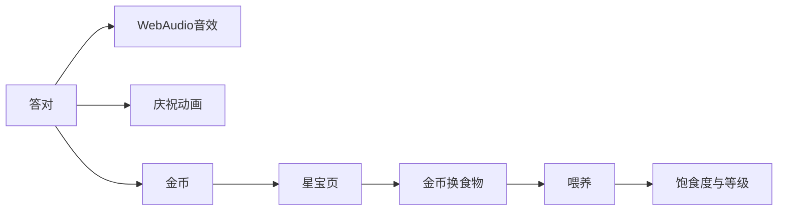

# 儿童思维识字 H5 — 1.1 迭代设计

**日期：** 2026-09-09  
**状态：** implemented  
**相对一期：** 在 [`2026-09-07-kids-thinking-literacy-design.md`](./2026-09-07-kids-thinking-literacy-design.md) 之上增量；不推翻纯前端 / LocalStorage / 零构建约束。  
**实现计划：** [`../sdlc/2026-09-09-reward-pet-tts-plan.md`](../../dev/sdlc/2026-09-09-reward-pet-tts-plan.md)

## 背景与动机

一期上线后 Owner 反馈三类问题：

1. **语音偏机器**：Web Speech 默认语速/音调像播报，不像幼教口吻。  
2. **跟读录音无闭环**：录完丢弃、不能回放；「开始/结束录音」提示抢戏。  
3. **答对反馈弱**：缺音效与动画；希望有金币 / 喂养小动物一类轻游戏奖励。  
4. **BGM 点了无声**：`AudioContext.resume()` 未等待 + 首音延迟，体感静音。

## 目标

- TTS 更拟人（口气、节奏），仍零后端、无云 TTS。  
- 录音可按字/关卡保存（会话内）、可回放；提示口语化且不盖过人声。  
- 答对 → 音效 + 庆祝动画 + 金币；金币可喂「星宝」。  
- 修好 BGM；交付前必须有可复查的冒烟证据。

## 非目标

- 云端拟人 TTS / API Key。  
- 录音永久云存或 IndexedDB 跨设备（会话内存即可；跨刷新可后续加）。  
- 宠物商城皮肤、排行榜、联网对战。  
- 数学 / 英语正式模块（仍占位）。

## 设计定案

### A. 拟人播报（方案 B，已选）

| 项 | 定案 |
|---|---|
| 人设 | 温柔幼教老师（略慢、略软） |
| 选声 | 对系统中文女声打分：prefer Tingting/Meijia/Xiaoxiao/Google/Microsoft enhanced；降权 compact/robot/child |
| 韵律 | `rate≈0.86`，`pitch≈1.04`；按 `。！？，` 拆短句，句间停顿 90–280ms |
| 文案 | 口语化（「好，轮到你啦」「录好啦」）；少用生硬「开始录音/录音结束」 |

备选曾评估：只调参（A，不够）；云 TTS（C，违一期约束）。

### B. 跟读录音闭环

```
点跟读 → 申请麦克风 → 短引导语说完 → 开录（安静）
     → 点「说完了」→ Blob 存入 state.recordings[key]
     → 显示「听我的录音」→ Audio 回放
```

- key：`lit:<字>` / `express:<mode>:<index>`  
- 仅本次会话内存；不上传。  
- 表达关同步有回放按钮。

### C. 答对奖励与星宝



| 场景 | 金币 |
|---|---|
| 识字四选一对 | +2 |
| 「我认识」 | +1 |
| 思维答对 / 表达完成 | +2 |
| 测验每题答对 | +1（报告显示本次赚币） |

食物定价（定案）：胡萝卜 3 / 苹果 5 / 小鱼干 8；饱食度 0–100，满 100 升级并回落。

数据扩展（`kidsThinkLit.v1` profile，缺字段兼容补齐）：

```text
coins: number
pet: { name, level, hunger, foods: { carrot, apple, fish }, lastFedAt }
```

### D. BGM 修复

- `unlockAudio()`：`ensureAudio` + **await** `resume` 至 `running`。  
- `startBgm`：解锁后**立刻**播第一拍，再 `setInterval`。  
- `visibilitychange` 回前台时尝试再 resume。  
- 选曲：先开 BGM，再短 TTS，避免未解锁就排音符。

## 验收

见根目录 `CHECKLIST.md`；自动化证据：`docs/dev/evidence/smoke-2026-09-09.md`。

## 仓库路径勘误

一期稿写的路径为 `/Users/zolad/work/app/kids-literacy-h5`；实际仓库为  
`/Users/zolad/work/app/yirenge/kids-literacy-h5`（GitHub：`brainee/kids-literacy-h5`，Pages 已开）。
